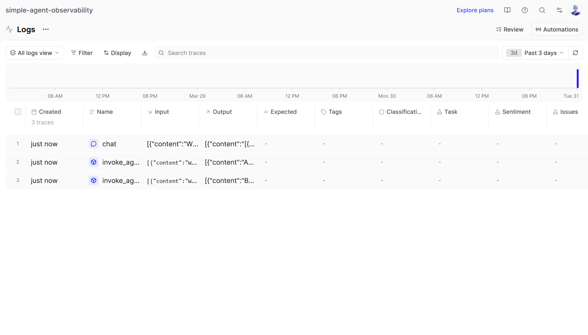
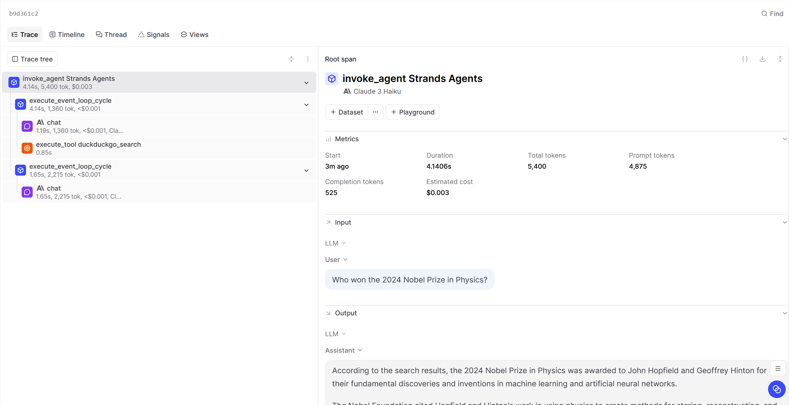
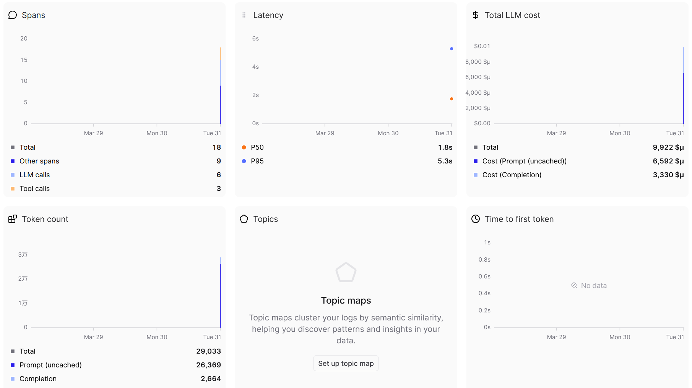

After each question is entered, a new trace is generated.

*Overview of multiple traces from Logs view*

The structure of each trace is similar. There is a root span, and the model used throughout the process is Claude 3 Haiku. Under the root span, there are two task spans. In the first task span, there is a tool span and an LLM span. The agent uses the DuckDuckGo search as the tool span, and the LLM span contains not only the current input but also previous inputs as memory. In the second task span, the LLM span combines the search results to generate the final answer.

*Detailed view of a single trace showing spans*

Each trace captures several metrics, including start time, duration, offset time, total tokens, prompt tokens, completion tokens, and estimated cost. From these metrics, I noticed that prompt tokens account for a much larger share of both token usage and cost than completion tokens. I also observed a positive relationship between token count, duration, and cost: when the number of tokens increases, the response usually takes longer and costs more. In addition, questions that require more analysis and synthesis seem to use more tokens than questions with more direct or definite answers.

*Metrics view showing token usage, latency, and other metrics*

Another interesting observation is that when the agent uses a tool, the trace includes an additional task span and another LLM span, which leads to higher token usage. However, tool usage can also make the final answer more accurate and better supported by evidence. The dashboard also makes the whole problem-solving process of the agent much clearer and easier to follow. If the agent gives an incorrect answer or does not perform as expected, I can look back at the trace to identify which step likely caused the problem, so the agent can be adjusted more precisely.